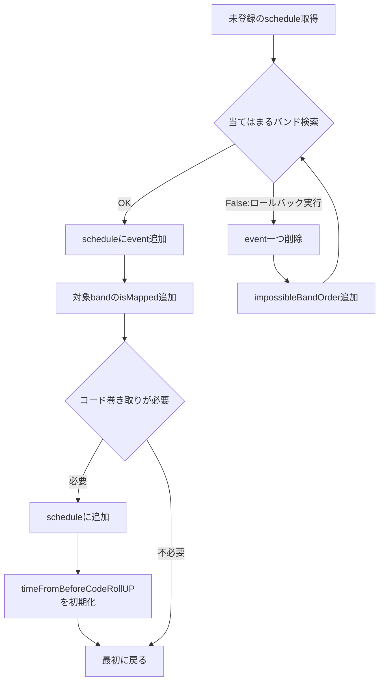
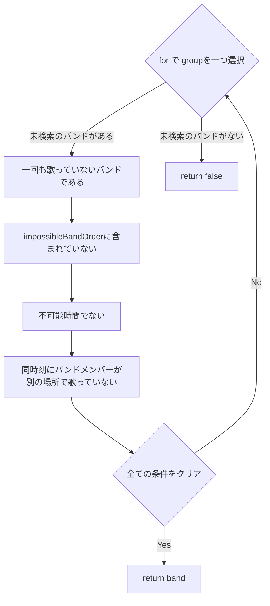

所属しているアカペラサークルにおいて、文化祭における出演バンドのスケジュールを自動調整するシステムを作成する。

## 要件
- バンドは4~6人で構成されている
- 出演者は同時に出演することができない
- 出演場所は二つあり、カフェ、ストが存在する
- カフェ→ストの移動時間は5分以上、スト→カフェの移動時間は10分以上になるようにする必要がある
- カフェは同じ人が連続して出演することができない
- バンドの種類は、本バンド、企画バンド、OBバンドの三種類が存在する
- 希望時間をストは5,10、カフェは10,15で選ぶことができる
- 1回目はスト、カフェかを希望できる
- 2回目以降も出演することができる
- バンドごとに出演不可能時間帯を設けている
- コード巻きの時間が必要
  - とりあえず1時間あたり5分と仮定する

## エンティティの抽出
- バンド
- 出演者
- 出演場所
- スケジュール

バンドごとに行う登録アンケート
https://docs.google.com/forms/d/e/1FAIpQLSfnKAXA472-krfHU3hf8zalhOIFo6RB-y9YV0jYpPivp-4rRw/viewform

実際の進行表例
http://inspishinkou.web.fc2.com/


## このプロジェクトの概要

### 意味
- Goを利用して実際に稼働するプログラムを0から作成しきる
- 就活で見せるポートフォリオにする

### 達成の条件
各種CSVを読み込んで、結果をCSVに書き込む

### 期限
8月末

### 取り組み方
1日1時間やる。なので多分60hくらいある。
休日は2hやる

### タスクフロー
- [x] CSVImport 10h
- [ ] システムの実装 30h
- [ ] CSVOutput 10h
- [ ] システムの統合テスト 10h
- [ ] 簡単な入力でのテスト 10h

--- ここまではやりきる ---

- [ ] GoogleSpreadSheetによるフォームの作成
- [ ] フォームのバリデーションスクリプト記述
- [ ] データの入力・実行


## システム


### アルゴリズム

この問題はNP困難である。
直近は全探索で一つずつ試す。
これで時間がかからないようであればこれでOK

### クラス図

<!-- ```mermaid
classDiagram
    Band : ID
    Band : Name
    Band : DesireLocationID
    Band : BandType
    Band : IsMultiPlay
    Member : ID
    Location: ID
    Schedule: ID
``` -->

### シーケンスフロー

基本的には、上から順に決めていく。
無理ならロールバックする

登録処理

1. 1日目のcafe
2. 1日目のstreet
3. 2日目のcafe
4. 2日目のstreet
5. ...

という順番でスケジュールを決定していく



埋まりきらない場合、２回目出演バンドの決定方法

バンド検索の詳細

